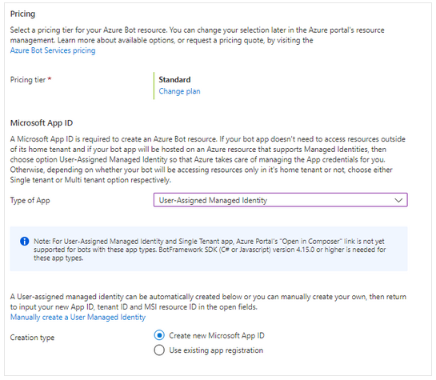

# ClC3 - Chatbot mit Node.js und LUIS

In diesem Projekt ist der CoreBot des Bot Framework v4 verwendet worden.
In Verbindung mit dem CoreBot ist LUIS für die Spracherkennung zuständig. LUIS ist ein AI based NLP Tool von Microsoft Azure Cognitive Services.
Für Codeänderungen des Bots ist mithilfe von Githup bzw Github Actions eine CI/CD Pipeline eingerichtet, die automatisiert den aktuellen Commit buildet, testet und in eine Web App von Microsoft Azure deployed.
Das gesamte Projekt ist mit einer Node.js App realisiert.

## LUIS (Language Understanding)

Unser Chatbot ist auf dem Modell einer Flugreservierung aufgebaut. Dieses Modell ist im Ordner `cognitiveMOdels/FlightBooking.json` zu finden. 

### Setup
1. [Anmelden im LUIS portal](https://docs.microsoft.com/en-us/azure/cognitive-services/luis/sign-in-luis-portal)  und falls benötigt  [create an account](https://docs.microsoft.com/en-us/free/cognitive-services/)  und [authoring resource](https://docs.microsoft.com/en-us/azure/cognitive-services/luis/luis-how-to-azure-subscription).
2. **Create a new authoring resource** und wähle einen **Resource Name**, Location (west europe) und Pricing Tier (F0 free).

3. Wählen Sie auf der Seite **Conversation apps** in [LUIS](https://www.luis.ai/applications) den Abwärtspfeil rechts neben **New App** und dann **Import als JSON**.

4. Wähle im  **Import new app**  Dialog die  **FlightBooking.json**  Datei aus und klick auf **Done**.

### Training und Publish
5. In der Ressource muss nun die LUIS App trainiert werden. Das geht mit einem Klick auf **Train**.
6. Über **Test** kann die App getestet werden. 
7. Mit **Publish** und der Auswahl von "Staging Slot" und "Production Slot" kann die trainierte LUIS App nun in Microsoft Azure gepublished werden.
8. Danach kann in Microsoft Azure auf die in Schritt 2 erstellte Resource Group gewechselt werden. Die `LuisAppId` ist unter **Übersicht** und hier **Abonnement-ID** zu finden, dder `LuisAPIHostName` ist der **Endpunkt**. Der benötigte `LuisAPIKey` ist unter **Schlüssel und Endpunkt** und hier Schlüssel 1 zu finden.

### Konfigurierung 

Ist das LUIS Modell erstellt, folgt die Konfiguration der Node.js App. In die Dati `.env` müssen die `LuisAppId`, `LuisAPIKey` and der `LuisAPIHostName` eingetragen werden.

```text
LuisAppId="780a4354-6867-4f2a-8730-bcc3efc0a596"
LuisAPIKey="447ed256500845e295c31215abc5827d"
LuisAPIHostName="westeurope.api.cognitive.microsoft.com"
```

## Node.js Chatbot Lokal

Im ersten Schritt muss lokal eine Node.js Version laufen, die der Version 10.14 oder höher entspricht. Dieses Projekt ist auf der Version 16.13.2 aufgesetzt.
Die Version kann mit folgendem Kommando überprüft werden.

- [Node.js](https://nodejs.org) version 16.13.2

    ```bash
    # determine node version
    node --version
    ```

- Klonen des Git - Repository

    ```bash
    git clone https://github.com/RelaXx394/clc3-ChatBot.git
    ```

- Node.js Module installieren

    ```bash
    npm install
    ```

- Setup LUIS

- Starten des ChatBots lokal

    ```bash
    npm start
    ```

## Chatbot lokal testen

Um den Chatbot lokal zu testen oder debuggen wird die Desktopapp [Bot Framework Emulator](https://github.com/microsoft/botframework-emulator) benötigt. 
Folgende Schritte sind nötig, um sich mit dem Chatbot zu verbinden:

- Launch Bot Framework Emulator
- File -> Open Bot
- Enter a Bot URL of `http://localhost:3978/api/messages`
- Connect

Um eine lokale Verbindung zum Chatbot aufbauen zu können ist es wichtig, dass die Microsoft Variablen in der `.env` Datei nicht eingetragen sind. Andernfalls führt dies zu einem Authentifizierungsfehler.
Die Microsoft Variablen werden erst später benötigt, um sich mit der Azure Webapp zu verbinden.

```text
MicrosoftAppType=""
MicrosoftAppId=""
MicrosoftAppPassword=""
MicrosoftAppTenantId=""
```

## Deploy Chatbot in Azure

### Voraussetzungen

Zu Beginn muss sichergestellt werden, dass ein Abonnement für [Microsoft Azure](https://azure.microsoft.com/de-de/) vorhanden ist. Der Chatbot muss lokal mit Erfolg gebuildet werden können. Weiters muss eine aktuelle Version der [Azure Cli](https://docs.microsoft.com/de-de/cli/azure/install-azure-cli) installiert sein. 
Alle folgenden Resoucen auf Azure sind in der Resourcen Gruppe `clc3-projekt` erstellt. Diese muss vorab im Azure Portal erstellt werden.

### Anmelden bei Azure

Bei Azure kann man sich über die CLI mit dem Befehl `az login` anmelden. Ist die Anmeldung erfolgt, wird ein Ähnliche Meldung zurückgeliefert

```text
[
    {
        "cloudName": "AzureCloud",
        "homeTenantId": "....",
        "id": "...",
        "isDefault": true,
        "managedByTenants": [],
        "name": "Azure for Students",
        "state": "Enabled",
        "tenantId": "...",
        "user": {
            "name": "s2020595028@fhooe.at",
            "type": "user"
        }
    }
]
```

Weiters muss das Standardabonnement (Azure-Subscription-id) festgelegt werden

```text
az account set --subscription "<azure-subscription-id>"
```

### Erstellen der Azure-Anwedungsregistrierung

Es muss mit folgendem Befehl eine Azure-Anwendungsregistrierung erstellt werden, um den Bot mit den Azure Bot Service-Kanälen verwenden zu können. 

```text
az ad app create --display-name "displayName" --password "AtLeastSixteenCharacters_0" --available-to-other-tenants
```

### Azure Bot via Azure Portal erstellen

Für den Chatbot wird eine Azure Bot Resource verwendet.

- Im Azure Portal anmelden
- In die Resourcen Gruppe wechseln
- Eine neue Resource erstellen und nach Bot suchen
- Nun die Resource Azure Bot auswählen
    
    
- Nach der Erstellung des Azure Bots öffnet sich die Konfigurationsseite. Bei dieser ist wichtig, dass bei `Creation type` der Punkt `Create new Microsoft App ID` ausgewählt ist. Unter dem Punkt `Type of App` muss `User-Assigned Managed Identity` ausgewählt sein

    
- Review + Create

Jetzt ist es möglich die Identityinformationen des Azure Bots auszulesen. Diese müssen danach in die `.env` Datei eingetragen werden. Diese Informationen können unter dem Punkt Overview oder Configuration nachgelesen werden. Bei der UAMSI bleibt das Passwort ein blank.

```text
MicrosoftAppType="UserAssignedMSI"
MicrosoftAppId="<Client ID der UserAssiggnedMSI>"
MicrosoftAppPassword=""
MicrosoftAppTenantId="<Azure Bot Tenant ID>"
```

### Erstellen des Botanwendungsdiensts

Wir erstellen die Botanwendung mit der bereits mitgelieferten ARM-Vorlage für bereits vorhandene Resourcengruppen. Diese ist unter dem Pfad `deploymentTemplates/template-with-preexisting-rg.json` zu finden.
Wir haben in diesem Schritt gleichzeitig den App Service-Plan für die Wepapp erstellt. Dieser regelt die Zahlungsbedingungen.

```text
az group deployment create --resource-group "clc3_projekt" --template-file ".\deploymentTemplates\template-with-preexisting-rg.json" --parameters appId="<Client ID der UserAssiggnedMSI>" appType="UserAssignedMSI" tenantId="<Azure Bot Tenant ID>c" existingUserAssignedMSIName="MyFlightBookBot" existingUserAssignedMSIResourceGroupName="clc3_projekt" botId="MyFlightBookBot" newWebAppName="MyFlightBookBotWebApp" newAppServicePlanName="MyFlightBookBotServicePlanName" appServicePlanLocation="westeurope" --name "MyFlightBookBot"
```

Nun ist es wichtig das Pricing der Webapp zu überprüfen und die gewünschte Einstellung zu wählen. Dies kann unter dem Punkt `Scale up (App Service plan)` der Webapp ausgewählt werden.

### Vorbereiten für Deployment

Die Projektdateien müssen vorbereitet werden, um den Chatbot bereitzustellen. Der folgende Befehl erzugt eine Datei vom Typ `web.config` im Projektordner. Die Node.js App benötigt diese Dateien, um mit IIS in Azure App Services verwendet zu werden. Die web.config-Datei wird im root Verzeichnis erstellt. 

```text
az bot prepare-deploy --code-dir "." --lang Javascript
```

Ausgabe

```text
true -> web.config generated
```

Im letzten Schritt muss die gesamte Projektstruktur noch gezipt werden (Ordner, der die indes.js Datei enthält). Dieser Schritt ist nur nötig, wenn noch keine CI/CD Pipeline aufgesetzt worden ist. 

```text
az webapp deployment source config-zip --resource-group "clc3_projekt" --name "MyFlightBookBotWebApp" --src ".\flightbookbot.zip"
```

Es muss eine Meldung angezeigt werden, die folgende Zeile enthält: `"provisioningState": "Succeeded"`

### Testen im Webchat

Der Bot kann nach dem erfolgreichem Deployment mittels der `Test in Web Chat` Funktion getestet werden. 


## CI/CD Pipeline

### GitHub Actions deployment 

Im ersten Schritt muss das Secret `AZURE_WEBAPP_PUBLISH_PROFILE` hinzugefügt werden. Dieses kann in der Webapp unter dem Punkt `Deployment Center/Manage publish profile` als xml Datei gedownloadet werden. Der Inhalt dieser Datei muss als Inhalt des oben genannten Secret gespeichert werden. 

Im GitHub Repo muss unter der Ordnerstruktur `/.github/workflows/` das `main_MyFlightBookBotWebApp.yml` erstellt werden. 

- Entwicklungsumgebung muss erstellt werden

```text
env:
  AZURE_WEBAPP_NAME: MyFlightBookBotWebApp
  AZURE_WEBAPP_PACKAGE_PATH: '.'
  NODE_VERSION: '16.13'         

jobs:
  build:
    runs-on: ubuntu-latest
    steps:
    - uses: actions/checkout@v2

    - name: Set up Node.js
      uses: actions/setup-node@v2
      with:
        node-version: ${{ env.NODE_VERSION }}
        cache: 'npm'
```

- Builden und Testen der Webapp

```text
- name: npm install, build, and test
      run: |
        npm install
        npm run build --if-present
        npm run test --if-present
    
- name: zip artifact for deployment
    run: zip -r release.zip .

- name: Upload artifact for deployment job
      uses: actions/upload-artifact@v2
      with:
        name: node-app
        path: release.zip
```

Der zip step ist wichtig, weil das Deployment die gesamten Artefakte uploaden bzw downloaden muss. Da dies sehr viel Dateien sind würde dies ohne den zip Schritt sehr lange dauern.

- Deploy to App Service

```text
deploy:
    runs-on: ubuntu-latest
    needs: build
    environment:
      name: 'Development'
      url: ${{ steps.deploy-to-webapp.outputs.webapp-url }}

    steps:
    - name: Download artifact from build job
      uses: actions/download-artifact@v2
      with:
        name: node-app
    
    - name: unzip artifact for deployment
      run: |
        unzip release.zip
        rm release.zip

    - name: 'Deploy to Azure WebApp'
      id: deploy-to-webapp 
      uses: azure/webapps-deploy@v2
      with:
        app-name: ${{ env.AZURE_WEBAPP_NAME }}
        publish-profile: ${{ secrets.AZURE_WEBAPP_PUBLISH_PROFILE }}
        package: ${{ env.AZURE_WEBAPP_PACKAGE_PATH }}
```

Die erfolgreichen Deployments können unter GitHub/Actions beobachtet werden. 


Im Deployment Center der Webapp kann der aktuell aktive Commit begutachtet werden.


## Gesamtbild


# Lessons Learned
### Code understanding
Python wird nicht unterstütz daher mussten wir auf C# und .js umsteigen. Das Wissen über diese Programmiersprachen fehlte in unserem Team.

###  Github Actions Dauer
Durch zippen der Files konnte die Dauer des Deployment von ~40 Minuten auf ~8 Minuten gesenkt werden.

### Schwieriges Debbugin
Error Messages sind, wenn vorhanden, nicht sehr intensiv besprochen. 
Beispiel:  “an error  has  occurred – check the source code“

### IDs und Keys Übersicht
Für Ressourcen werden oft eine ID oder Name benötigt. Diese soll eindeutig und unverwechselbar sein und es ist sehr hilfreich, wenn diese in einem ".txt" File nebenbei abgespeichert werden um sie bei Verlinkungen zwischen Ressourcen bereit zu haben.


## Problems
### Azure Zusammenarbeit 
Die Zusammenarbeit ist mit Free Accounts nur bedingt möglich.

### Outdated Dokumentation
In Detailfragen nur limitierte Dokumentation. Bei der Umsetzung des Projektes fanden wir sehr oft Outdated Documentation. Das größte Problem war hier, dass sich die Dokumentation und Tutorials oft auf den "Web App Bot" beziehen, diesen gibt es allerdings nicht mehr da er "deprecated" wurde.


### App Registration
Für eine App Registration fehlen die Berechtigungen bei Studentenkonten. 


#### Python
Der eigentlich Plan war einen SDK Example Bot in Python zu ergänzen und umzuschreiben. Bei einem lokalen Test (localhost) funktioniert der Python Bot wie beabsichtigt nur leider unterstützen die SDKs für Python nur "multi-tenant" Bots.
Diese "multi-tenant" Bots können nicht auf Microsoft Azure verwendet werden ohne eine App Registration vorher durchzuführen.


#### Bot Framework Composer
Microsoft Azure empfiehlt für die Entwicklung von Bots die Desktop-App "Bot Framework Composer". Auch hier funktioniert der Bot bei lokalen Tests wie beabsichtigt, nur kann bei einem Publish in Microsoft Azure die App Registration nicht erstellt werden. 


Es gibt auch einen Issue dazu in Github, jedoch tritt dieser Fehler auf, da der "Bot Framework Composer" nur "multi-tenant" Bots unterstützt.

https://github.com/microsoft/BotFramework-Composer/issues/8283
